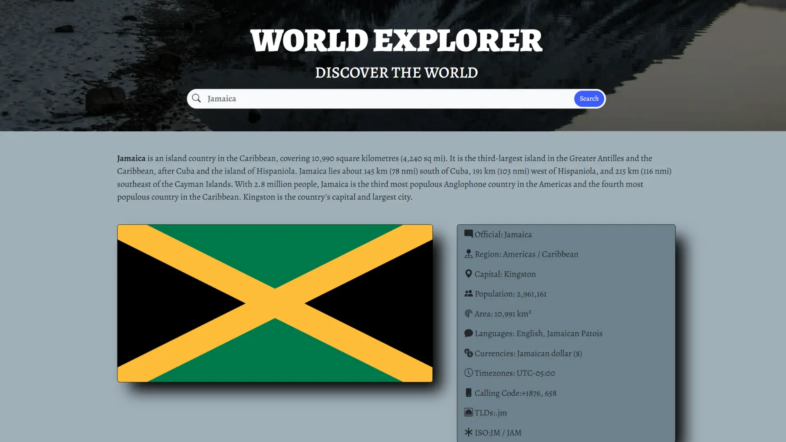

A responsive web application for exploring countries around the world. Built with Bootstrap, semantic HTML, and modern JavaScript, it allows users to view, search, and filter country data fetched from a public API.



## Live demo

[](https://dazdingo11.github.io/worldexplorer/)

## Overview

-   Single HTML entry: `index.html`
-   Country data is fetched from a public API and rendered dynamically by `assets/scripts/script.js`.
-   Built with Bootstrap 5 and small, focused custom CSS in `assets/css/style.css`

## Features

-   Responsive layout using Bootstrap's grid system
-   Accessible, semantic markup
-   Dynamically generated country cards
-   Search and filter functionality
-   Modern image assets in WebP format for good performance

## Tech stack

-   
-   
-   
-   
-   

-   HTML5
-   CSS3 (Bootstrap 5 + custom styles)
-   JavaScript (ES modules)

## Quick start

1.  Clone the repository:
    ```bash
    git clone https://github.com/Dazdingo11/worldexplorer.git
    cd worldexplorer
    ```
2.  Since this project uses ES module imports and may fetch data from APIs, you'll need to run it from a local web server to avoid CORS and module loading issues.

    If you have Python 3 installed:

    ```bash
    python3 -m http.server 8000
    ```

    Or, if you have Node.js and `http-server` installed:

    ```bash
    npx http-server -p 8000
    ```

3.  Open your browser and navigate to `http://localhost:8000`.

## Project Structure

-   index.html — main page
-   assets/
    -   css/ — `style.css` (and other CSS assets)
    -   images/ — webp images used by the site
    -   scripts/ — `script.js` (and any other JS files)
-   LICENSE — project license (MIT)

## Contributing

Contributions are welcome! Please open an issue to discuss what you would like to change or submit a pull request.

### Contributors

A big thank you to all our contributors for their hard work and dedication!

<a href="https://github.com/leightongrant" title="leightongrant">
  
</a>
<a href="https://github.com/Dazdingo11" title="Dazdingo11">
  
</a>
<a href="https://github.com/mamtadhone" title="mamtadhone">
  
</a>

## License

This project is licensed under the MIT License — see the `LICENSE` file for details.

## Contact

For questions or feedback you can reach the author via the email in the site footer or by opening an issue in this repository.
